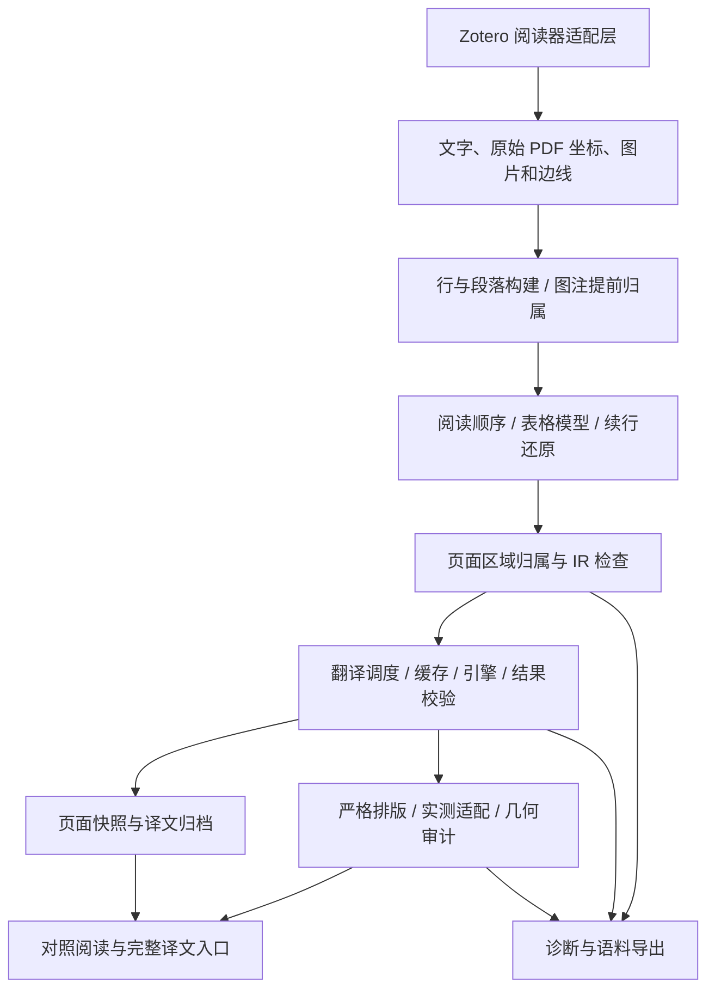

# PaperMirror 4.0.0 架构

本文对应 4.0.0 的实际代码。框架围绕“保存原文结构、翻译内容、在边界内显示”组织；区域归属是约束与诊断信息，不是新的翻译过滤条件。

## 主链路

## 适配与会话

- `src/reader/zoteroReaderAdapter.ts` 隔离 Zotero 非公开阅读器接口。官方 Reader、Prefs、HTTP 等 API 可直接使用。
- `src/reader/readerSession.ts` 管理一个阅读器标签页的视图、提取器、翻译管理器、滚动同步与资源释放。
- 引导层安装沙箱所需的兼容设施。切换视图与恢复页面显示不应要求重新请求翻译接口。

## 提取与结构

`src/reader/textExtractor.ts` 按可用性尝试字符接口、PDF.js `getTextContent`、文本层；纯文本回退不具备可靠的逐块版面几何。不同路径共用段落与结构处理，但证据丰富程度不同。

`spanBlockBuilder.ts`、`blockBuilder.ts` 和 `paragraphHeuristics.ts` 将字符或跨度组成行、段落与栏位。`captionOwnership.ts` 在普通段落合并前识别有充分标签和行对齐证据的图注。`tableBorders.ts` 与 `tableStructure.ts` 提供边框/文本表格结构；`src/ir/tableModel.ts` 描述单元格及其对应关系。

`pageRegions.ts` 在现有续行还原后分配正文栏、单元格、页眉页脚和其余图注的 `SourceRegion`。提前给临时栏位的碎片固定归属会破坏正常续行，因此正文归属晚于该还原步骤；图注的显式提前归属仍阻止跨区域合并。

归属包括 ID、类别、原始 PDF 坐标边界和证据来源。单元格边界来自表格模型；正文分带结合既有栏位及跨栏区域，并允许少量受其他原文边界限制的下方空白。未获得可靠坐标的块不能凭空补造几何。`documentIR.ts` 审计 ID、阅读顺序、表格及区域契约；运行期审计并不等于自动修复。

## 翻译与状态

`src/translation/translationManager.ts` 负责请求计划、并发、取消、重试、缓存及结果校验。结构类别不自动等于保留原文：是否请求、引擎是否完成翻译、译文是否放得下必须分别记录。

- `restoreForDisplay` 从已有状态恢复显示，独立于请求调度。
- 取消未完成任务时保留已完成的译文；补译处理缺失部分。
- 缓存命中取决于语言、引擎、模型、提示词和源内容等身份信息，结构缓存有独立版本。
- `displayRestores`、`supplementBlocks`、`repeatedBlockSubmissions` 分别记录恢复、补译及重复提交。重复提交可能来自重试或取消后的续传，不能直接等同于浪费。
- `src/export/pageArchive.ts` 保留页面内容与译文快照；语料和诊断用于区分提取、保留、校验拒绝与排版失败。

## 排版与显示

对照页的核心是 `src/ui/strictPageReplacement.ts`。它在原页图像上按原文行遮罩，利用真实文字测量适配译文；绕图使用安全区域，单元格采用提取期边界。正文不横向侵入栏间距，下方适配同时受区域、图片、其他文字和底图墨迹限制。图注与单元格不使用普通正文的扩边策略。

最终几何检查处理重叠与图片侵入。无法放置时保留完整译文和失败原因，交由完整译文入口查看；不能用截断或覆盖相邻内容伪装完成。几何通过也不能证明语义归属正确，已混合的源块仍需在提取阶段修复。

覆盖模式通过会话提供的页面渲染器复用严格排版核心，但宿主挂载、交互与生命周期不同，不能用对照页测试宣称覆盖模式同样完成真机验证。页面同步按页与页内位置处理，显示恢复和引擎请求分别调度。

## PDF 导出

`src/pdfgen/` 使用 pdf-lib 生成 PDF，属于独立输出路径。内置字体、字形覆盖和坐标转换有自己的约束；浏览器排版通过不代表导出逐像素一致。正式发布前的 XPI 检查验证清单、版本和资源允许列表，不能代替真实 PDF 导出验收。

## 测试与演进顺序

1. 类型检查与单元测试：结构、缓存、取消、归属和安全边界。
2. 41 页真实跨度语料：分段快照、全文字符清单、IR 及请求计划基线。
3. 浏览器回归：保存的真实译文在多种缩放下检查完整性、放置率和最终几何；超长受控译文单独验证边界。
4. XPI 构建检查与 GitHub 发布资产验证。
5. Zotero 真机：复杂表格、长文往返滚动、覆盖模式、导出与自动更新。

下一步优先补齐上游混栏的独立结构证据、源块与单元格语义对应检查，以及真机视觉回归。当前栏位仍来自启发式推断，区域联合框不是独立正确性证明；4.0.0 不引入视觉模型、OCR 或外部排版服务，也不宣称全部复杂版式已解决。
